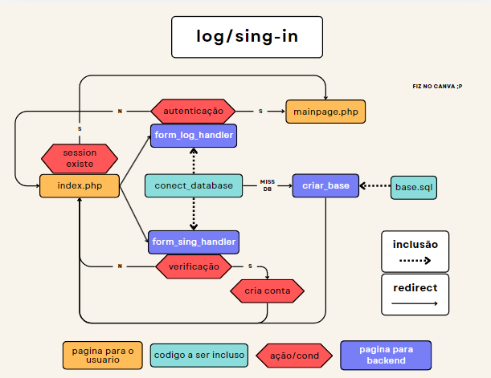
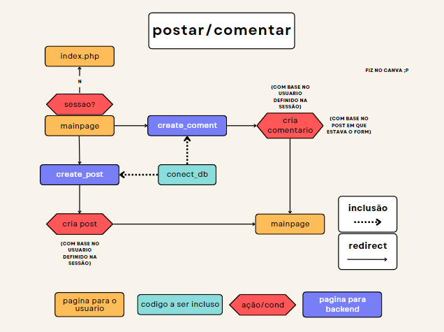
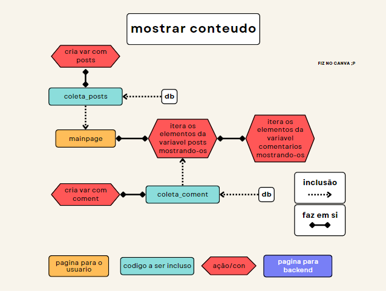

# Trabalho Cumulativo de TecWeb: Rede Social

## Informações do Grupo e Orientador

* **Sala:** INFO-F
* **Matéria:** Tecnologias Web (Tecweb)
* **Curso:** Técnico em Informática (2º ano)
* **Escola:** Instituto Federal do Sul de Minas Gerais - Campus Muzambinho (IFSULDEMINAS-Muzambinho)
* **Alunos:**
  * Gilberto Damasceno Ferreira Junior
  * Maria Clara Prado Okada
  * Felipe Volpi
  * Rafael Victor de Paula
* **Professor:** Herberty

## Tema: Rede Social

Uma rede social completa com as seguintes funcionalidades:
* **Postagens:** Criação, edição e exclusão de posts.
* **Comentários:** Interação com os posts através de comentários.
* **Curtidas:** Demonstração de aprovação nos posts.

## Tecnologias Utilizadas

* **Front-end:** HTML, CSS, JavaScript
* **Back-end:** PHP
* **Banco de dados:** MySQL
* **Ferramentas:** XAMPP, VSCode, MySQL Workbench, Git, GitHub

## Estrutura do Projeto

### Sistema de Log in e Sing in

#### Demonstração

<video controls src="apresentacaoassets/sing_log_demonstration.mp4" title="Title"></video>

## Sistema de post e comentario

#### Demonstração

<video controls src="apresentacaoassets/posts.mp4" title="Title"></video>

## Próximos Passos

* **Funcionalidades:**
  * Sistema de amizades
  * Mensagens diretas
  * Página de administração com funções de moderação
  * PHP atuante sem necessidade de atualizar (redirectar) pagina
  * Algoritmo de recomendação de posts (dificil mas talvez)
* **Melhorias:**
  * Responsividade completa utilizando JavaScript
  * Melhoria da interface do usuário
  * Otimização do desempenho

## Diretório do Projeto no GitHub
https://github.com/DamascoFerraz/TrabalhoCumulativoTW

## Documentação utilizada
* **PHP:** https://www.php.net/docs.php

## Contribuições

>Agradecemos a qualquer contribuição para o nosso projeto! Sinta-se à vontade para abrir issues ou pull requests no nosso repositório do GitHub.